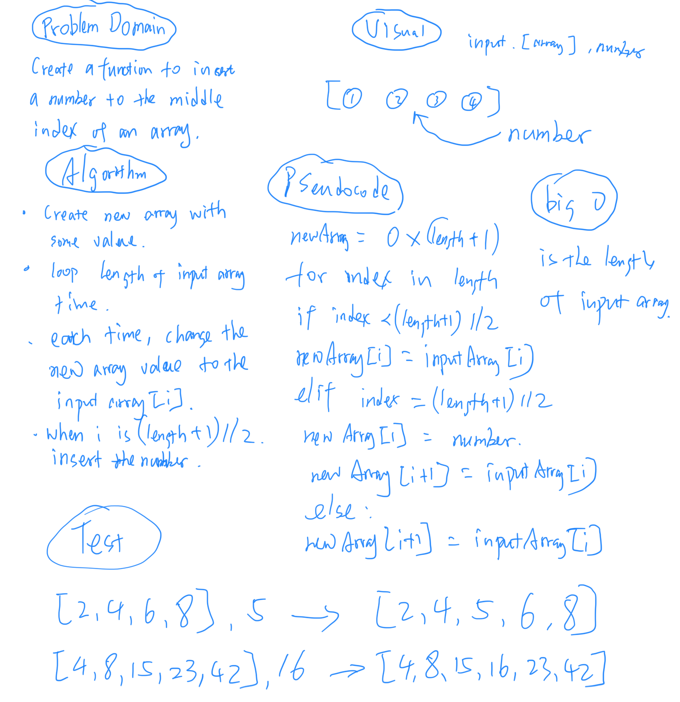

# Insert and shift an array in middle at index
## Challenge
<!-- Description of the challenge -->
Write a function called **insertShiftArray** which takes in an array and the value to be added. Without utilizing any of the built-in methods available to your language, return an array with the new value added at the middle index.

## Approach & Efficiency
<!-- What approach did you take? Why? What is the Big O space/time for this approach? -->
without using any build-in list method, it is:
1. build new array, length is input array length +1, fill array with anything.
2. make a for loop, range to input array length
3. when index smaller than (input array length+1 ) //2, new array element is updated by input array element with same index number.
4. when index is equal to (input array lenght +1) //2, new array element with index is equal to the value to be added.
5. then new array with (index number + 1) will be updated by input array element with index number.

## Solution
<!-- Embedded whiteboard image -->

