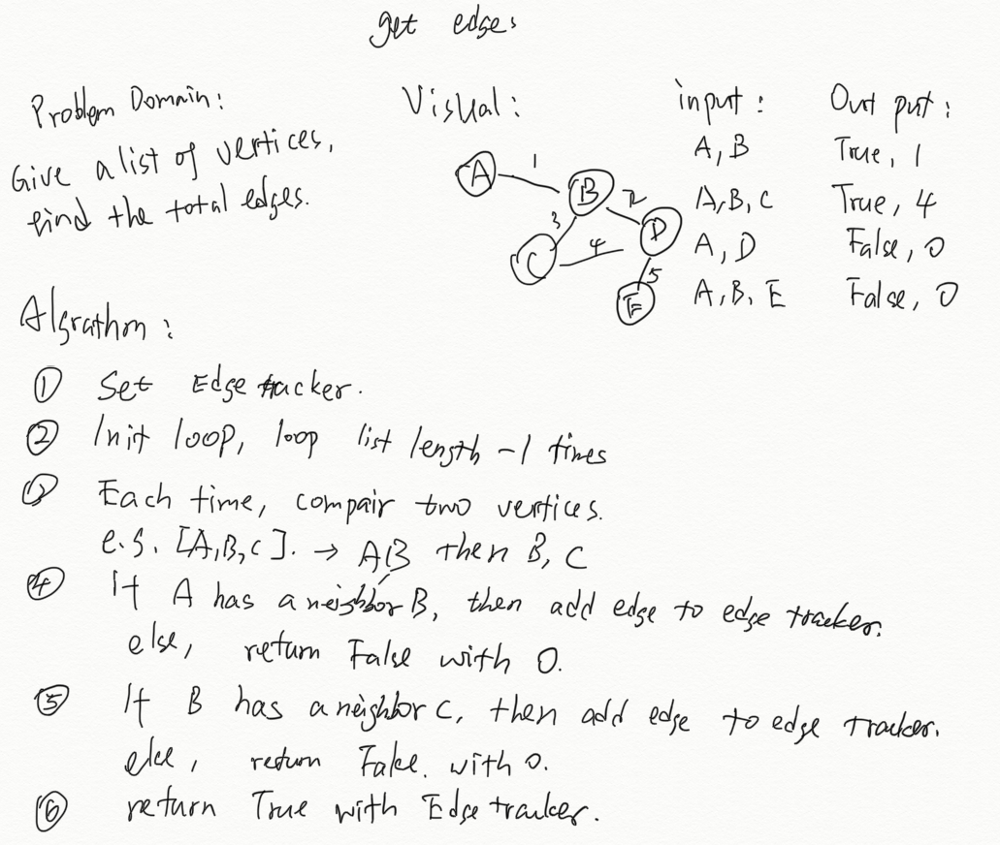

# Code Challenge

[Click here to see the code](get_edge.py)

[Click here to see the tester](../../../tests/challenges/get_edge/test_get_edge.py)

Given a business trip itinerary, and an Alaska Airlines route map, is the trip possible with direct flights? If so, how much will the total trip cost be?

## Feature Tasks

- Write a function based on the specifications above, which takes in a graph, and an array of city names. Without utilizing any of the built-in methods available to your language, return whether the full trip is possible with direct flights, and how much it would cost.

## Structure and Testing

Utilize the Single-responsibility principle: any methods you write should be clean, reusable, abstract component parts to the whole challenge. You will be given feedback and marked down if you attempt to define a large, complex algorithm in one function definition.

Write at least three test assertions for each method that you define.

Ensure your tests are passing before you submit your solution.

## Example

|Input|Output|
|--|--|
|[Metroville, Pandora, ] |True, $82|
|[Arendelle, Monstropolis, Naboo]|True, $115|
|[Naboo, Pandora]|False, $0|
|[Narnia, Arendelle, Naboo]|False, $0|

## Solution

