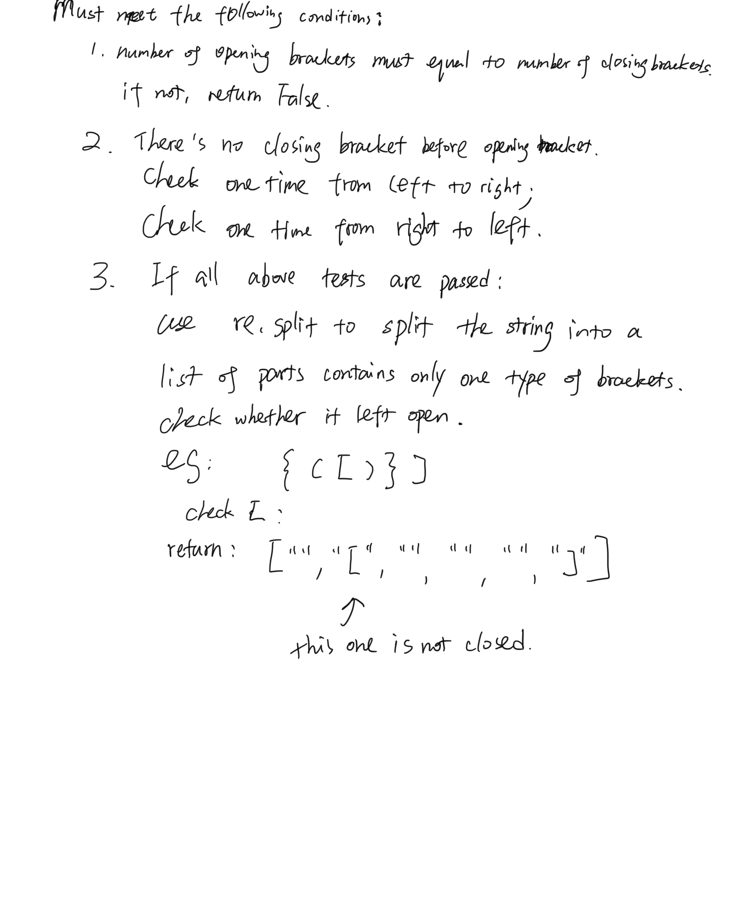

# Multi-bracket Validation.
[Click here to see the code](multi_bracket_validation.py)

[Click here to see the tester](../../../tests/challenges/multi_bracket_validation/test_multi_bracket_validation.py)

# Feature Tasks
Create a function called ```multi_bracket_validation(input)```

Your function should take a string as its only argument, and should return a boolean representing whether or not the brackets in the string are balanced. There are 3 types of brackets:

- Round Brackets : ()
- Square Brackets : []
- Curly Brackets : {}

# Example
|Input	|Output|
|--|--|
|{}	|TRUE|
|{}(){}	|TRUE|
|()[[Extra Characters]]	|TRUE|
|`(){}[[]]`	|TRUE|
|`{}{Code}[Fellows](())`	|TRUE|
|`[({}]`	|FALSE|
|(](	|FALSE|
|{(})	|FALSE|

# Solution

