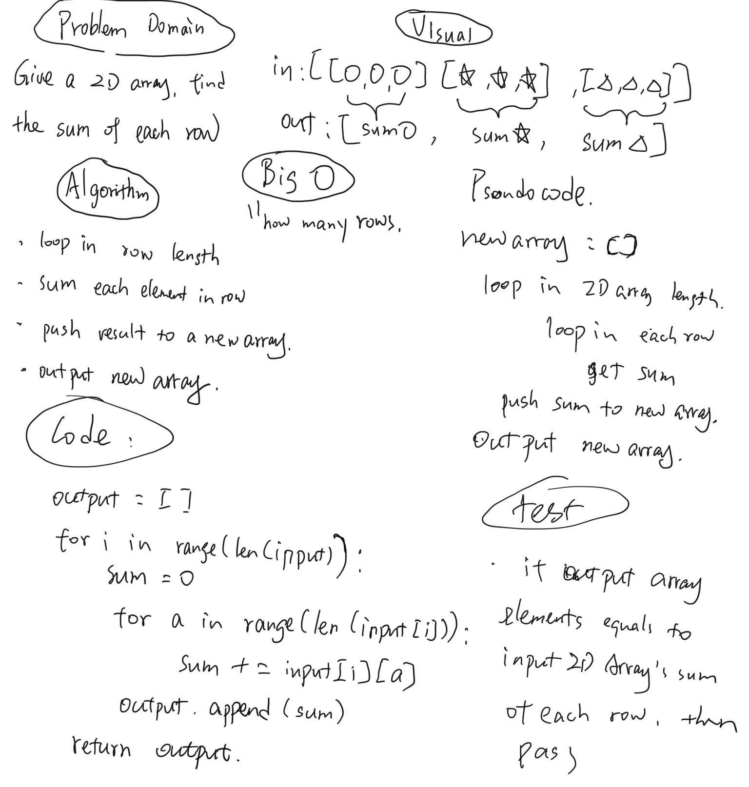

# Given a matrix, find the sum of each row

[click here to see the code](sum_2D_array.py)

## Challenge
<!-- Description of the challenge -->
- Write a function to add up the sum of each row in a matrix of arbitrary size, and return an array with the appropriate values.
- Avoid utilizing any of the built-in methods available to your language.
- The matrix will always be full of integers.
- Negative values are possible.
- All nulls will be counted as zeros.

## Approach & Efficiency
<!-- What approach did you take? Why? What is the Big O space/time for this approach? -->
without using any build-in list method, it is:
1. Determine the length of the metrics, build a for loop to loop through it.
2. On each time looping through it, build a insider loop to loop through the sub-list inside of it, and add the numbers all together.
3. in the outter loop, append the result to a new array.
4. output the new array.

## Solution
<!-- Embedded whiteboard image -->

