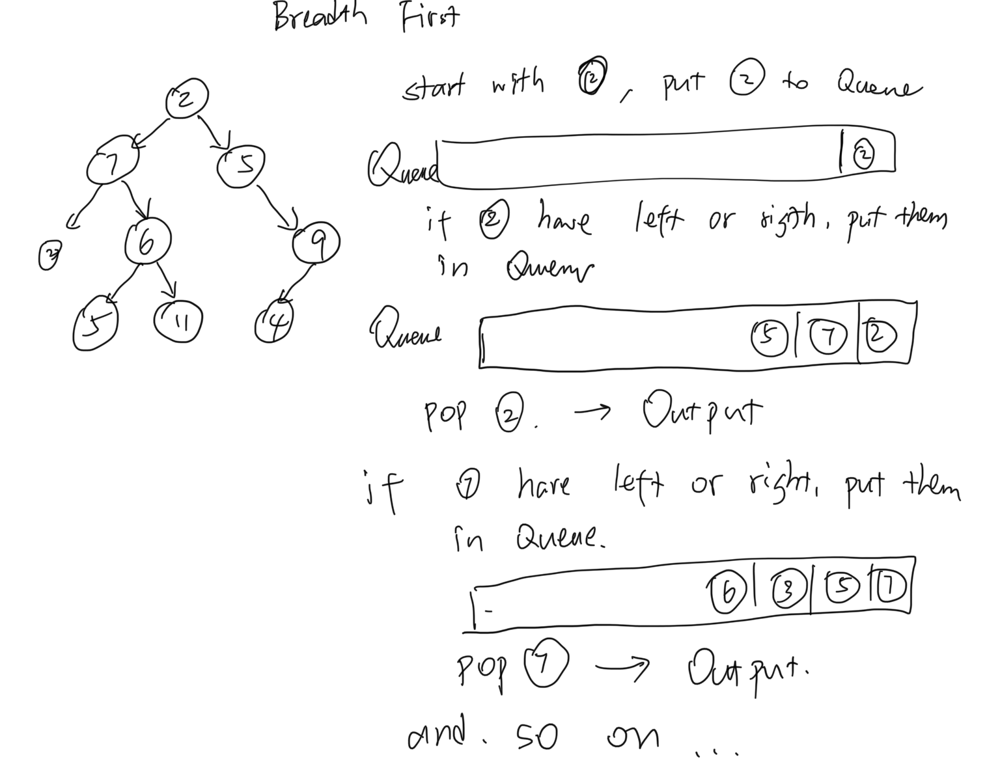

# Implementation: Trees

[click here to see the code](tree.py)
[click here to see the tester code](../../../tests/challenges/../data_structures/tree/test_tree.py)

## Features
- Create a Node class that has properties for the value stored in the node, the left child node, and the right child node.
- Create a BinaryTree class
    - Define a method for each of the depth first traversals called **preOrder**, **inOrder**, and **postOrder** which returns an array of the values, ordered appropriately.
- Any exceptions or errors that come from your code should be semantic, capturable errors. For example, rather than a default error thrown by your language, your code should raise/throw a custom, semantic error that describes what went wrong in calling the methods you wrote for this lab.

- Create a BinarySearchTree class
    - Define a method named **add** that accepts a value, and adds a new node with that value in the correct location in the binary search tree.
    - Define a method named **contains** that accepts a value, and returns a boolean indicating whether or not the value is in the tree at least once.

## Structure and Testing
Utilize the Single-responsibility principle: any methods you write should be clean, reusable, abstract component parts to the whole challenge. You will be given feedback and marked down if you attempt to define a large, complex algorithm in one function definition.

Write tests to prove the following functionality:

1. Can successfully instantiate an empty tree
2. Can successfully instantiate a tree with a single root node
3. Can successfully add a left child and right child to a single root node
4. Can successfully return a collection from a preorder traversal
5. Can successfully return a collection from an inorder traversal
6. Can successfully return a collection from a postorder traversal

## solution:


- Pre-order:  ```100, 50, 25, 75, 200, 155```
- In-order: ```25, 50, 75, 100, 155, 200```
- Post-order: ```25, 75, 50, 155, 200, 100```


- Breadth first: ```[2,7,5,2,6,9,5,11,4]```



## Big O
for O time, all four method equals to the number of nodes.

